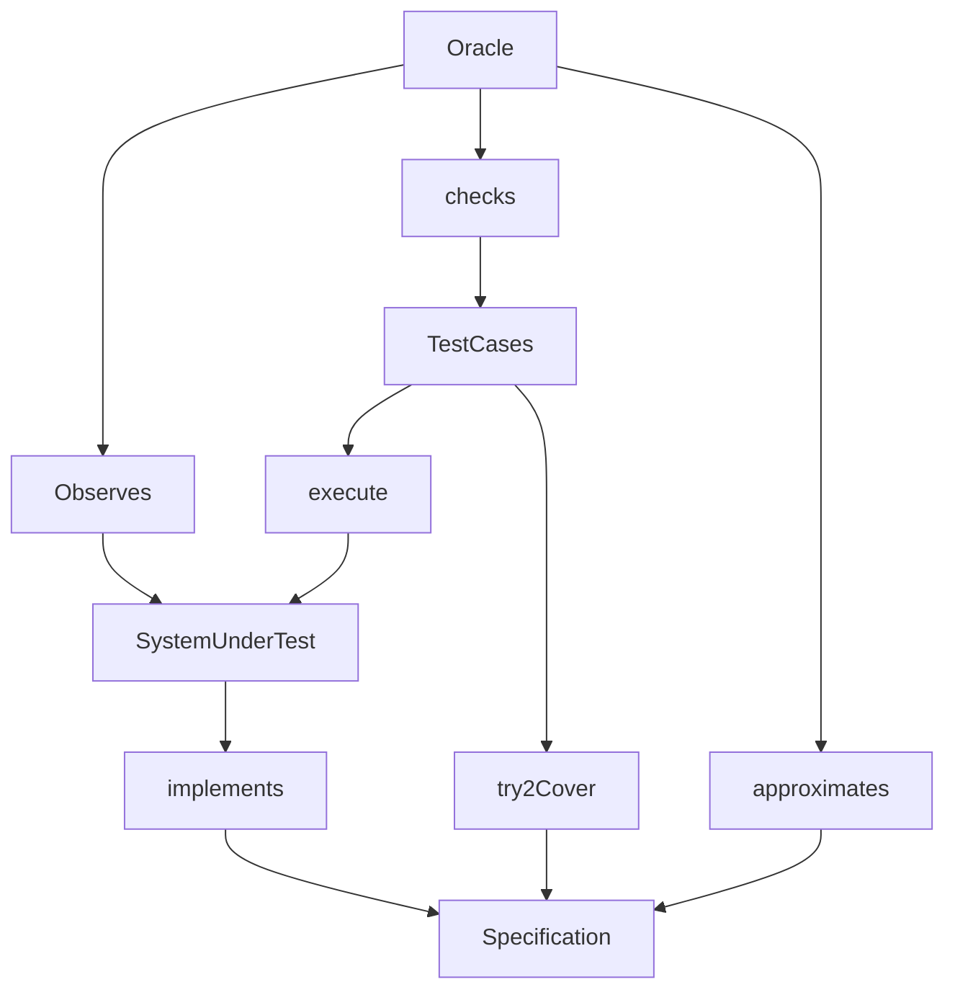
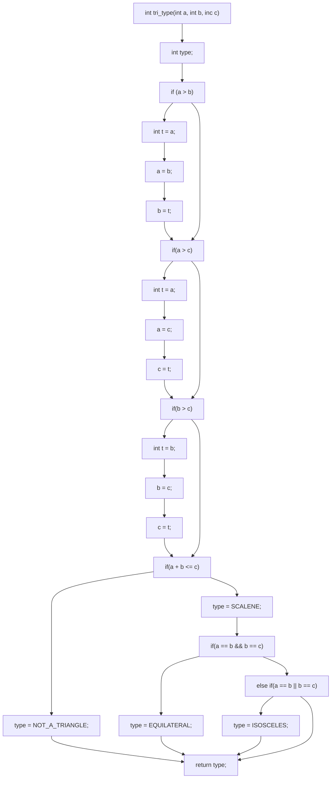
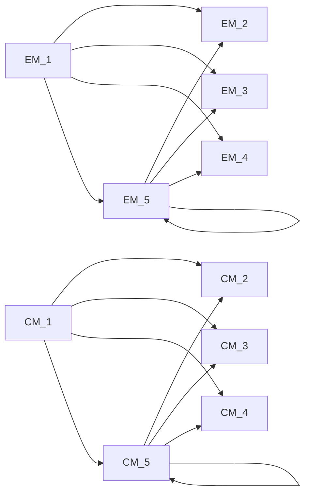

# Overview
Software quality and how to get to it

Test-driven development
- White box testing  
- Black box testing 
# Software Quality
## Why is Software Quality relevant: Case of Bard
Google Bard AI mistake just cost Google over $100 billion
By Philip Michaels last updated February 09, 2023
AI-powered chatbot makes costly error in early demo
https://www.tomsguide.com/news/google-bard-ai-is-off-to-an-embarrassing-start

Isabel Angelo @IsabelNAngelo Follow
Unfortunately a simple google search would tell us that JWST actually did not "take the very first picture of a planet outside of our own solar system" and this is literally in the ad for Bard so I wouldn't trust it yet
Google
@Google
Bard is an experimental conversational Al service, powered by LaMDA. Built using our large language models and drawing on information from the web, it's a launchpad for curiosity and can help simplify complex topics → goo.gle/3HBZQtu
Introducing Bard,
an experimental conversational Al service powered by LaMDA
You can use Bard to -
Plan a friend's baby shower
Compare two Oscar nominated.. Get lunch ideas based on what's in your fridge

The chatbot generated an incorrect fact about the James Webb Space Telescope in its very first public demo. The incident has dramatically highlighted one of the most pertinent dangers for marketers using AI: it doesn’t always tell the truth.
https://www.thedrum.com/news/2023/02/09/attention-marketers-google-s-100bn-bard-blunder-underscores-current-dangers-using-ai
## Why is Software Quality relevant?
- Reputation
- Cost of Product and Maintenance
- Software Certification
- Organizational Certification
- Legality
- Moral/ethical codes of practice
### Reputation
Reputation Software developers and their organisations rely on reputation. A poor quality product (or family of products) can be enormously damaging for business. Software bugs can have immediate impacts on custom, especially in customer-facing industries. The automotive software problems with Volkswagen have led to an enormous amount of negative publicity, which has a direct impact on sales. 
### Limiting Costs of Product and Maintenance Cost 
Limiting Costs of Product and Maintenance Cost is an overriding factor in software development. Poor quality software tends to be expensive to develop and to maintain, which can have a detrimental effect on business. Poor software quality can lead to technical debt, where the organisation in charge of the software needs to invest a disproportionate amount of resources into maintaining and running the software to make up for (and to try and remedy) poor design and implementation decisions. 
### Software Certification
Software Certification Depending on the domain of the software (e.g. in Aircraft or Rail), the development and use of software might be restricted, and dependent on obtaining some form of certification. For example, software in modern civilian aircraft often has to be certified to the DO178 standard, which requires the extensive use of software quality assurance procedures throughout the software development lifecycle. 
### Organisational Certification
Organisational Certification The organisational procedures and structures that are employed for software development can have a huge bearing on the quality of the software they produce. There are various ways by which to categorise the extent to which an organisation employs good practice. International certification procedures and standards such as CMM and ISO90017 exist, so that software development organisations can advertise their “capability” to develop high quality software. 
### Legality
Legality Depending on the country, there may be overriding legal obligations that apply to organisations that use software. For example, in the UK, organisations have to demonstrate that the risk posed by their technology (this includes software) is “As Low As Reasonably Practicable” or “ALARP” . In other words, every “practicable” measure must have been taken to demonstrate that (in our case) the software system does not pose a risk to its users. 
### Moral / ethical codes of practice
Moral / ethical codes of practice Even in cases where a software system is not covered by industrial certification and legislation, and where its failure is not necessarily business or safety-critical, there can remain a moral obligation to the users. Professional organisations such as the American Computer Society (ACM) have explicit ethical guidelines and codes of practice, with statements such as “Software engineers shall act consistently with the public interest”. This clearly implies that they ought to do whatever possible to maximise the quality of their software and to prevent it from containing potentially harmful bugs. 
# Software Quality is Multi-dimensional
Subjective or “fitness for use”: as perceived by an individual user (e.g., aesthetics of GUI, missing functionality…)
- Fitness for use: Joseph Juran embodied the idea that the quality of product revolves around its fitness for use . He argued that, ultimately, the value of a product depends on the customer’s needs. Crucially, it forges the product developers to focus on those aspects of the product that are especially crucial (the vital few objectives) as opposed to the useful many. 

Objective or “conformance to requirements”: can be measured as a property of the product (e.g., detailed documentation, number of bugs, compliance with regulations …. )
	
- Conformance to Requirements: Phil Crosby embodied a different tone. He defined quality as “conformance to requirements” . His opinion was that quality can be achieved by the disciplined specification of these requirements, by setting goals, educating employees about the goals, and planning the product in such a way that defects would be avoided. 
	
Practical: what does it mean to your team and your clients?
## Quality Models: ISO/IES25010
Functional Suitability
- Functional Completeness
- Functional Correctness
- Functional Appropriateness

Performance Efficiency
- Time Behaviour
- Resource Utilisation
- Capacity

Compatibility
- Co-existence
- Interoperability

Usability
- Appropriateness
- Realisability
- Learnability
- Operability
- User Error Protection
- User Interface Aesthetics
- Accessibility

Reliability
- Maturity
- Availability
- Fault Tolerance
- Recoverability

Security
- Confidentiality
- Integrity
- Nonrepudiation
- Authenticity
- Accountability

Maintainability
- Modularity
- Reusability 
- Analysability
- Modifiability
- Testability

Portability
- Adaptability
- Installability
- Replaceability

## Steps Towards Software Quality:

Use a standard development process

Use a coding standard
- Compliance with industry standards (e.g., ISO, Safety, etc.)
- Consistent code quality 
- Secure from start
- Reduce development costs and accelerate time to market

Define and monitor metrics (defect metrics and complexity metrics) 
- High complexity leads to higher number of defects

Identify and remove defects
- Conduct manual reviews
- Use Testing 
# Testing
Mauro Pezze and Michal Young. Software testing and analysis - process, principles and techniques. Wiley, 2007. 
## Testing process: key elements and relationships


- Oracle -> Observes -> System under test
- Test Cases -> execute -> System under test
- Oracle -> checks -> Test Cases
- System under test -> implements -> Specification
- Oracle -> approximates -> Specification
- Test Cases -> try to Cover -> Specification

From: M. Staats, M. W. Whalen, and M. P. E. Heimdahl. Programs, tests, and oracles: the foundations of testing revisited. In Software Engineering (ICSE), 2011 33rd International Conference on, pages 391–400. IEEE, 2011.

## System under Test (SUT)
System under Test (SUT) This is the system (or unit/function) being tested. It seeks to implement the specification. 
- The SUT can either be a white-box system, where we have complete access to the source code and the run-time state (e.g. the call-stack), or a black-box system, where we only have access to the external interface or API (depending on the type of system). It can also be a mixture of the two; for example, library routines might be provided in the form of closed source components, whilst the source code for the main core of the system is available for analysis.
The system might be reactive where the input / output behaviour at one stage is affected by previous inputs (e.g. a GUI), or it might process inputs in a single batch and return to its initial state. This matters from a testing perspective, because in the reactive case, the test inputs have to be formulated as sequences. 
- The system might be deterministic, where it always returns the same answer for a given input. It might however also be non-deterministic, where the same input can elicit different outputs (perhaps because of randomised internal behaviour, or other factors beyond control such as thread-scheduling). 
- It is commonly important to ensure that the SUT is an isolated version of the “live” system. 
## Specification
Specification A specification represents the idealised behaviour of the system under test. Depending on the development context, this might be embodied as a comprehensive, rigorously maintained document (e.g. a set of UML diagrams or a Z specification). Alternatively, if developed in an agile context, it might be a partial intuitive description captured in a selection of user stories, test cases, and documented as comments in the source code. 
- The nature of the specification has an obvious bearing on testing. If a concrete, reliable specification document exists and there is a shared understanding of what the system is supposed to do, this can be used as the basis for a systematic test-generation process. If this is not the case, then testing becomes a more ad-hoc and dependent upon the intuition and experience of the tester.
## Test cases
Test cases The test cases correspond to the executions of the SUT. In practical terms a test case corresponds to an input (or a sequence of inputs) to the system. 
- Test cases should ideally cumulatively execute every distinctive facet of software behaviour. An ideal test set (collection of test cases) should be capable of exposing any deviation that the SUT makes from the specification. If it can be shown to do this, the test set is deemed to be adequate. 
## Test Oracle 
Test Oracle Executing the test cases alone will not determine whether the SUT conforms to the specification or not. This decision – whether or not the output of a test is correct or not – is made by a test oracle. In practice, an oracle might be an assertion in the source code that is checked during the test execution, or it might be the human user, deciding whether or not the behaviour is acceptable. 
- Test oracles are notoriously difficult to produce. There is in practice rarely an explicit, comprehensive, up to date specification that can be used as a reference. A successful software has usually been developed over the course of decades by a multitude of developers, which means that, ultimately, there is rarely a definitive record of how exactly the system should behave. What’s more, there may be tens of thousands of test cases, each of which might produces complex outputs, which can make the task of manual validation of the outputs prohibitively time consuming. These issues are collectively referred to as the oracle problem. 
# Testing: White Box
Mauro Pezze and Michal Young. Software testing and analysis - process, principles and techniques. Wiley, 2007. 
## White Box Testing
Access to software ``internals’’: 
- Source code
- Runtime state
- Can keep track of executions.

White box testing exploits this to
- Use code to measure coverage
- Many different ways 
- Drive generation of tests that maximise coverage

```c
    int tri_type(int a, int b, int c) {
        int type;
        if (a > b)
        { int t = a ; a = b ; b = t; }
        if (a > c)
        { int t = a ; a = c ; c = t ; }
        if (b> c)
        { int t = b ; b = c ; c = t ; }
        if (a + b <= c )
            type = NOT_A_TRIANGLE;
        else {
            type = SCALENE;
            if (a == b && b ==c )
                type = EQUILATERAL;
            else if (a == b || b ==c )
                type = ISOSCELES;
        }
        return type;
    }
```

Access to software ``internals’’: 
- Source code
- Runtime state
- Can keep track of executions.

White box testing exploits this to
- Use code to measure coverage
- Many different ways 
- Drive generation of tests that maximise coverage.





Coverage Metrics: 
- Statement coverage 
- Branch coverage 
- Def-Use or Dataflow coverage 
- MC/DC (Modified Condition / Decision Coverage)
- Mutation coverage… 

Prescribed metrics, e.g., DO178-B/C standard for civilian aircraft software 
- non-critical - statement coverage
- safety-critical -  MC/DC coverage

Statement coverage: The proportion of executable statements in the program that have been executed. 

Branch coverage: The proportion of all of the logic-branches in the source code (e.g. outcomes of IF, WHILE, or FOR statements) to have been executed. 

Def-Use or Dataflow coverage: The source code is analysed to extract the def-use relations, which relate statements at which a variable is defined (i.e. instantiated and given a value) to subsequent statements using that definition. The test-goal is to cover all of the possible def-use relations. 

## Statement Coverage
- Test inputs should collectively have executed each statement
- If a statement always exhibits a fault when executed, it will be detected
- Computed as:

$$Coverage=\frac{|Statements\ executed|}{|Total\ statements|}$$

## Branch Coverage
- Test inputs should collectively have executed each branch
- Subsumes statement coverage
- Computed as:

$$Coverage = \frac{|Branches\ executed|}{|Total\ branches|}$$

## However….
Coverage Is Not Strongly Correlated with Test Suite Effectiveness
- Laura Inozemtseva and Reid Holmes School of Computer Science. University of Waterloo Waterloo, ON, Canada {Iminozem,rtholmes}@uwaterloo.ca

We have extended these studies by evaluating the relation- ship between test suite size, coverage, and effectiveness for large Java programs. Our study is the largest to date in the literature: we generated 31,000 test suites for five systems consisting of up to 724,000 lines of source code. We measured the statement coverage, decision coverage, and modified con- dition coverage of these suites and used mutation testing to evaluate their fault detection effectiveness.

We found that there is a low to moderate correlation between coverage and effectiveness when the number of test cases in the suite is controlled for. In addition, we found that stranger forms of coverage de not provide greater insight into the effectiveness of the suite. Our results suggest that coverage, while useful for identifying under-tested parts of a program, should not be used as a quality target because it is not a good indicator of test suite effectiveness.
# Testing: Black Box
Mauro Pezze and Michal Young. Software testing and analysis - process, principles and techniques. Wiley, 2007. 
## Black Box Testing
No access to “internals”
- May have access, but don’t want to

We know the interface
- Parameters
- Possible functions / methods

We may have some form of specification document
## Testing Challenges
- Many different types of input
- Lots of different ways in which input choices can affect output
- An almost infinite number of possible inputs & combinations
## Equivalence Partitioning (EP) Method
Identify tests by analysing the program interface
1. Decompose program into “functional units” 
2. Identify inputs / parameters for these units
3. For each input
	- Identify its limits and characteristics 
	- Define “partitions” - value categories 
	- Identify constraints between categories 
	- Write test specification
## Example – Generate Grading Component
The component is passed an exam mark (out of 75) and a coursework (c/w) mark (out of 25), from which it generates a grade for the course in the range 'A' to 'D'. The grade is calculated from the overall mark which is calculated as the sum of the exam and c/w marks, as follows:
- greater than or equal to 70 - 'A' 
- greater than or equal to 50, but less than 70 - ‘B’ 
- greater than or equal to 30, but less than 50 - ‘C’ 
- less than 30 - 'D' 
- Where a mark is outside its expected range then a fault message ('FM') is generated. All inputs are passed as integers. 
## EP – 1. Decompose into Functional Units
Dividing into smaller units is good practice
- Possible to generate more rigorous test cases. 
- Easier to debug if faults are found.

E.g.: dividing a large Java application into its core modules / packages

Already a functional unit for the Grading Component example 
## EP – 2. Identify Inputs and Outputs
For some systems this is straightforward
1. E.g., the Triangle program:

	- Input: 3 numbers, 
	- Output: 1 String
2. E.g., Grading Component
	- Input: 2 integers: exam mark  and coursework mark
	- Output: 1 String for grade

For others less so. Consider the following:
- A phone app.
- A web-page with a flash component.
## EP – 3.a Identify Categories
| Category | Description |
| --- | --- |
| valid | valid exam mark |
| valid | valid coursework mark |
| valid | valid total mark |
| Invalid | invalid exam mark |
| Invalid | invalid coursework mark |
| Invalid | Invalid total mark |

## EP: 3.b Define “Partitions” - value categories
Significant value ranges / value-characteristics of an input
| Category | Description | Partition |
| --- | --- | --- |
| Valid | EM_1 valid exam mark | 0 ≤  Exam mark ≤ 75 |
| Valid | CM_1 valid coursework mark | 0 ≤  Coursework mark ≤ 25 |
| Invalid | EM_2 invalid exam mark | Exam mark > 75 |
| Invalid | EM_3 invalid exam mark | Exam mark < 0 |
| Invalid | EM_4 invalid exam mark | alphabetic |
| Invalid | EM_5 invalid exam mark | real number |
| Invalid | CM_2 invalid coursework mark | Coursework mark > 25 |
| Invalid | CM_3 invalid coursework mark | Coursework mark < 0 |
| Invalid | CM_4 invalid coursework mark | alphabetic |
| Invalid | CM_5 invalid coursework mark | real number |

## EP – 3. c Identify Constraints between Categories
Not all categories can combine with each other
| Category | | Condition |
| --- | --- | --- |
| valid exam mark | EM_1 |  0 ≤  Exam mark ≤ 75 |
| invalid exam mark | EM_2 | Exam mark > 75 |
| invalid exam mark | EM_3 | Exam mark < 0 |
| invalid exam mark | EM_4 | alphabetic |
| invalid exam mark | EM_5 | real number |
| valid coursework mark | CM_1 | 0 ≤  Coursework mark ≤ 25 |
| invalid coursework mark | CM_2 | Coursework mark > 25 |
| invalid coursework mark | CM_3 | Coursework mark < 0 |
| invalid coursework mark | CM_4 | alphabetic |
| invalid coursework mark | CM_5 | real number |

## EP – 3. d Write Test Specifications


## Example: Inputs and Expected Outputs
The test cases corresponding to partitions derived from the input exam mark are:
Test Case	1	2	3
Input (exam mark)	44	-10	93
Input (c/w mark)	15	15	15
total mark (as calculated)	59	5	108
Partition tested (of exam mark)	0 < e < 75	e < 0	e > 7
Exp. Output	'B'	'FM'	'FM'
Boundary Values
	Most frequently errors occur in "edge" cases
	Test just under boundary value
	Test just above the boundary value
	Test the boundary value
How do we go about using this?
Testing applied in Java unit
Use JUnit
 uses “Assertions” to test the code
Allow us to state what should be the case
If assertions do not hold, JUnit’s logging mechanisms reports failures
Various types of assertion are available, e.g., assertEquals( expected, actual ); assertTrue( condition ); assertFalse( condition ); assertThat ( value, matchingFunction )
# Review
- What is Software Quality?
- What are key elements and relationships for test specifications?
- How do we carry out white-box testing?
- How do we carry out black-box testing?


